# World Happiness Report Data Analysis

## Introduction

This project involves an analysis of data from the World Happiness Report from 2015 to 2019. The purpose of this project is to answer an important question: which 
countries are the happiest, and what makes them so happy? On the other hand, which countries are the least happy and what makes them unhappy? Multiple techniques,
such as an exploratory data analysis, multivariate linear regression, stepwise regression, and regression trees will be utilized to predict happiness score and 
answer the question above. 
 

## The Data

All of the data used in this project comes directly from [Kaggle.com](https://www.kaggle.com/datasets/unsdsn/world-happiness). There are five datasets used in this project (World Happiness Report for 2015, 2016,
2017, 2018, and 2019), which were merged together into one large dataset for easier analysis. To run the code, make sure to download each of the csv files located in the folder titled "Data".

#### Response Variable (what we're trying to predict)

The reponse variable in this project is a country's happiness score. The data for happiness score comes from Gallup World Poll’s survey scores,
where Cantril’s Ladder of Life Scale was used to measure happiness. In order to obtain a happiness score, the survey asks respondents to imagine a ladder with
steps 0 to 10, with 0 being the absolute worst possible life, while 10 would be the best possible life. Respondents were then asked to rate their current lives based
on that scale. A country's happiness score is calculated by taking the national average of the survey responses. 

#### Explanatory Variables Explored

* Healthy Life Expectancy

* GDP

* Social Support

* Freedom to Make Life Choices

* Trust in Government

* Generosity

## Questions to be Answered

* **Which Countries are the Happiest and Which Are the Least Happy?** : out of all 153 countries in the dataset, which are the happiest, and which are the unhappiest?
In this project, the top 20 happiest countries as well as the bottom 20 countries will be determined. 

* **How does the Happiness Score of a Country Differ by Region?** : In addition to determining which countries are the happiest, the data will also be examined by
region to determine if there is a significant difference in the average happiness score among different regions. Which regions are the happiest and which are the 
unhappiest?

* **Which factors influence the level of happiness in a country?** : Do the explanatory variables above have any impact on a country's happiness score? If so,
what type of impact and how strong of an impact do they have? Which factors have the strongest impact on happiness score?

* **How have Happiness Scores Changed Over Time?** : As a whole, has the world gotten happier, or unhappier, in the period from 2015 to 2019?

## Findings

### 20 Happiest and Least Happy Countries

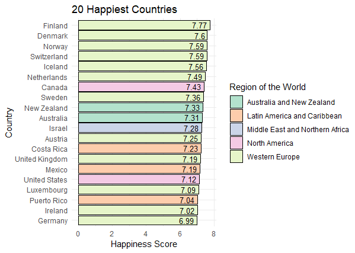 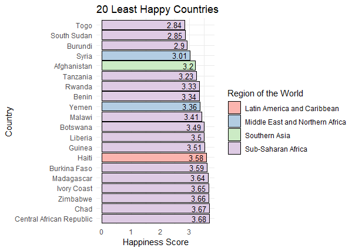 

* **Happpiest**: As the plots above show, a large portion of the top 20 happiest countries are located in Western Europe. Citizens of North America and the Australia/New Zealand region
also appear to be very happy, with all 4 countries from those 2 regions being part of the top 20. There were also a few countries from Latin America and one country (Israel) from the Middle East/North Africa region mixed in. 

* **Unhappiest**: As for the most unhappy countries, an overwhelmingly large majority of the 20 unhappiest countries were located in the Sub-Saharan Africa region. 
Only 4 of the countries in this category were located in a region other than Sub-Saharan Africa, with two of the unhappiest countries being located in the Middle East/
Northern Africa region, one located in Southern Asia, and one located in Latin America. 

**Note:** To obtain these results, only the highest score for each country (out of all 5 years) was considered to determine the top 20 happiest countries, and only
the lowest score for each country (out of all 5 years) was considered to determine the bottom 20 countries.

### How the Happiness Score Differs by Region

  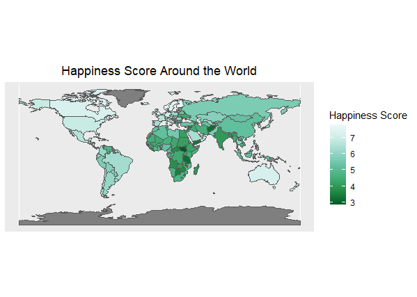

The map above shows happiness scores for different countries across the world, with happier countries being assigned a lighter color and unhappier countries being
assigned a darker color. According to the map, it appears as though Western Europe, North America, and the Australia/New Zealand Region are the happiest overall. 
Latin America, Central/Eastern Europe, and Eastern Asia appear to have moderate happiness scores. Countries located in South Asia and the Middle East/Northern Africa region appear to have relatively low happiness scores. The majority of the countries located in Sub-Saharan Africa have exceptionally low happiness scores.

  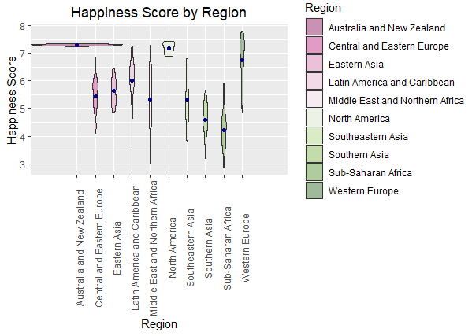

 This violin plot gives us a slightly better picture of how happiness scores are distributed in different regions. While countries in North America, Australia/NZ region, and East Asia have very little variation in happiness score, regions like the Middle East/North Africa and Latin America have very large differences in
 happiness score between their happiest and unhappiest countries. Interestingly enough, both of those regions have at least one country in the top 20 and at least one
 country in the bottom 20 as well. 
 
 
 ### Determining Which Factors Influence a Country's Happiness Score
 
 #### The Plots
 
 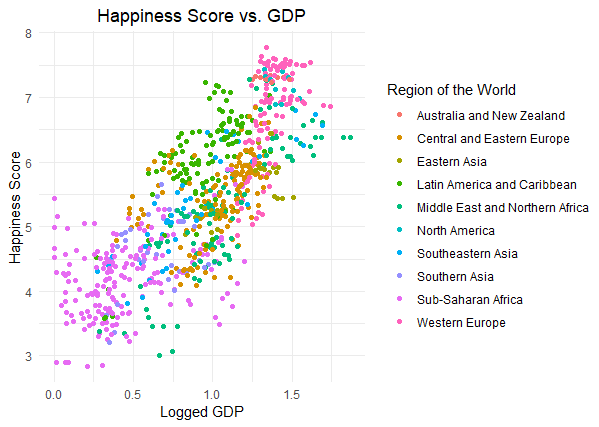 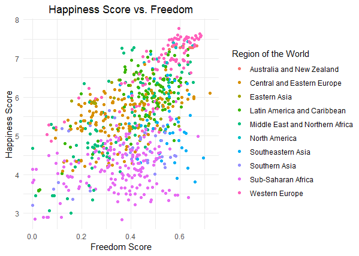 
 
 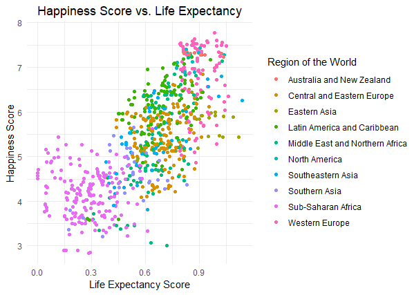 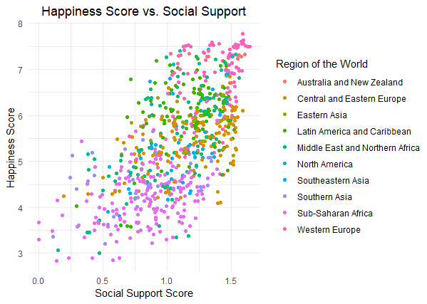 
 
 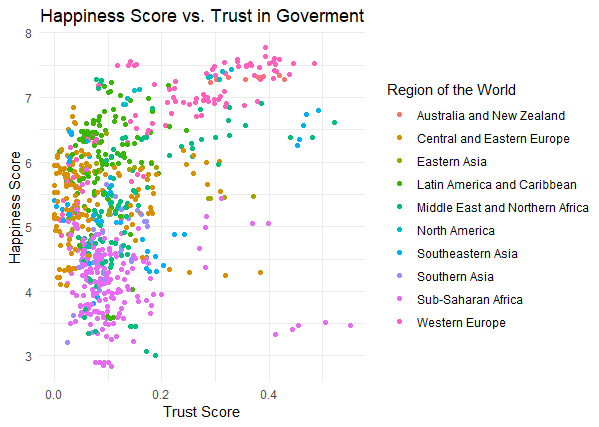 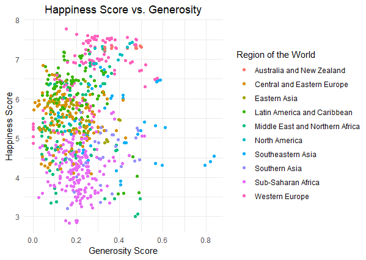 
 
 
 
 
 
 #### The Models
 
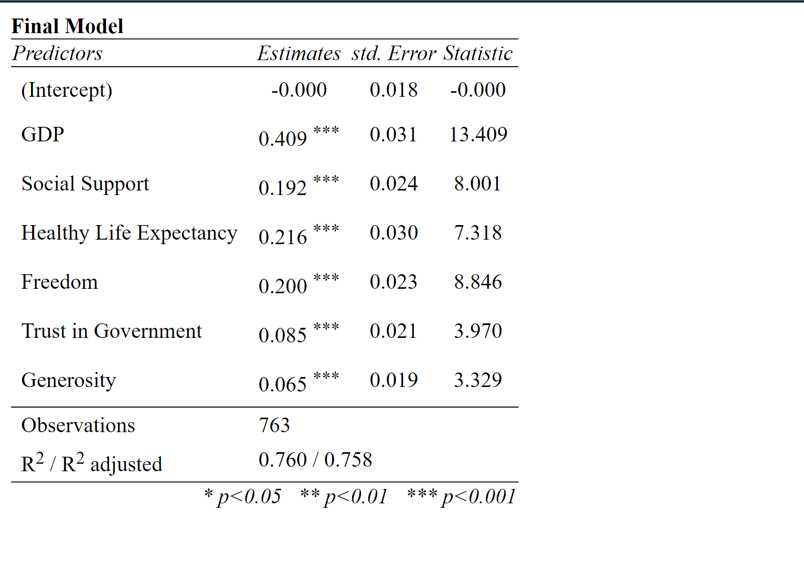 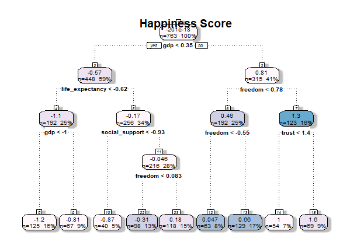 

To answer the question above, two different approaches were taken. The image on the left displays the coefficients of the final model obtained using stepwise regression. The image on the right displays a regression tree. In both models, GDP is the most important factor in predicting a country's happiness score; a country with a higher GDP will have a higher happiness score. Freedom to make life choices, healthy life expectancy, and social support also appear to have a strong positive influence on a country's happiness score. While trust in government and generosity may have a slight influence on happiness score, it's very small compared to the influence that the 4 other factors have on a country's happiness score. The plots show similar results; GDP, healthy life expectancy, freedom to make life choices,
and social support apppear to have a strong correlation with happiness score, while generosity and trust in government did not appear to have much of a relationship
with a country's happiness score.

### Happiness Scores over Time

  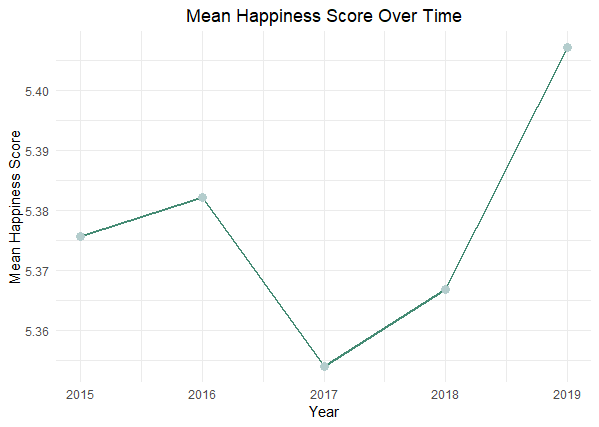

Over a span of 4 years, happiness scores haven't changed very much. The average happiness score has increased from 5.38 in 2015 to 5.41 in 2019. 2019 was the happiest year with an average score of 5.41, and 2017 was the unhappiest year with an average score of 5.35.
